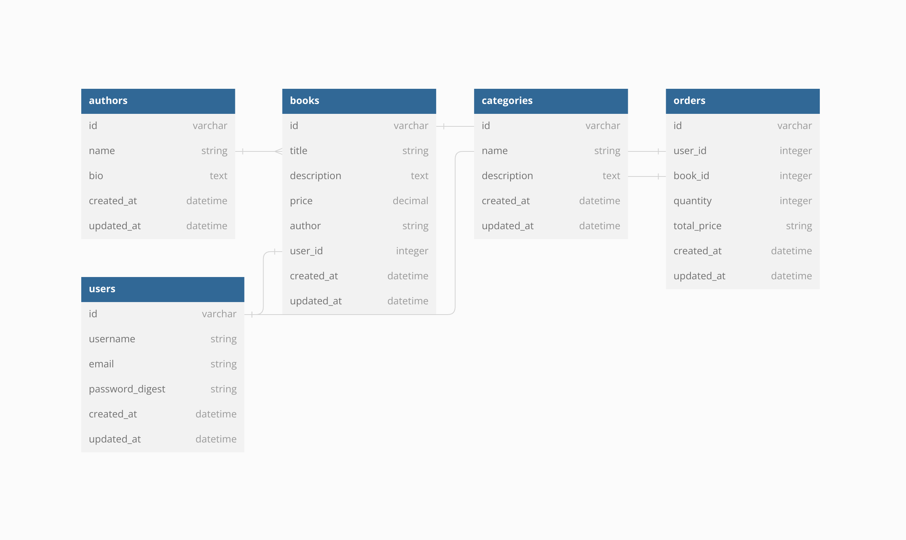

[](https://github.com/Jobwawesh/my-portfolio-app-backend/graphs/commit-activity)
[](http://makeapullrequest.com)
[](https://svgshare.com/i/Zhy.svg)
[](https://github.com/ellerbrock/open-source-badges/)

# BOOK STORE APP
Our book store app is the ultimate platform for book lovers. With our app, you can easily browse through a vast collection of books and purchase the ones you love.

Our app features a user-friendly interface with easy navigation, making it simple to view book titles and descriptions. We offer a wide variety of books, including fiction, non-fiction, biographies, self-help, and much more. Our extensive catalog features the latest and greatest titles from top publishers.

Overall, our book store app is the perfect solution for anyone who loves reading and wants to explore a wide range of books. Hope you enjoy, CHEERS!

## Entity Relationship Diagram(ERD)
This ERD is here to demonstrate the relationship between the model entities.



## Pre-Requisites
In order to use this repository you will need the following:


- Operating System **(Windows `10+`, Linux `3.8+`, or MacOS X `10.7+`)**
- RAM >= 4GB
- Free Space >= 2GB

## Built With
This application has been built with the following tools:


- **Ruby `v2.7.4`**
- **Rails `v7.0.4`**
- **SQlite3 `v1.4`**
- **ActiveRecord `v7.0.4`**
- **Puma `v6.1`**
- **Faker `v0.14`**
- **Bcrypt `v3.1.7`**

## Topics Covered
The following are the concepts covered in this practice session

- Active Record Migrations.
- Active Record Associations.
- Working with a database.
- DB routing.
- Performing CRUD operations.
- Serialization.
- Api creation.

## A deployed live link to this project:
This is the deployed link 
        https://superheroes-code-challenge-backend.onrender.com/heroes


## Installation

To use this repo on your machine requires some simple steps

### Alternative One

- Open a terminal / command line interface on your computer
- Clone the repo by using the following:

        git clone https://github.com/phase4-group-project/phase4-bookstore-app

- Be patient as it creates a copy on your local machine for you.
- Change directory to the repo folder:

        cd phase4-bookstore-app

- (Optional) Open it in ``Visual Studio Code``

        code .

- (Alternate Option) Open it in any editor of your choice.
- Hurray! You are one step closer to being as intelligent as Einstein.

### Alternative Two

- On the top right corner of this page there is a button labelled ``Fork``.
- Click on that button to fork the repo to your own account.
- Take on the process in ``Alternative One`` above.
- Remember to replace your username when cloning.

        git clone https://github.com/your-username-here phase4-bookstore-app

## Running the application
Running the application is very straight forward. You can use the following steps to run the app.

1. Ensure the ruby gems are setup in your machine
    ```{shell}
   bundle install
   ```
2. Perform any pending database migrations  and seeding
   ```{shell}
   rails db:migrate db:seed
   ```
3. Run the application
    ```{shell}
    rails server
    ```
4. Open the application from your browser
    ```
   http://localhost:3000
   ```
   
## Application
This application is a simple web API that allows users to:

- Register a new account.
- Log in to existing account.
- Create a BOOK items.
- View all BOOK items.
- Update a BOOK Item
- Delete a BOOK item.
- View books categories
- Get book by author
- Order for books 
- Delete order items

### MODELS
Database schema definitions.

#### USER
| COLUMN        | DATA TYPE | DESCRIPTION                           | 
|---------------|-----------|---------------------------------------|
| id            | Integer   | Unique identifier.                    |
| name          | String    | User's name.                       |
| password_hash | String    | User's password hashed with `BCrypt`. |
| updated_at    | Date      | The date the user was updated.        |
| createdAt     | Date      | The date the user was created.        |


#### BOOKS
| COLUMN      | DATA TYPE                                       | DESCRIPTION                            | 
|-------------|-------------------------------------------------|----------------------------------------|
| id          | Integer                                         | Unique identifier.                     |
| title       | String                                          | The name of the project.               |
| description | String                                          | A short description about the project. |
| price | Integer | The price of the book. |
| author | String | The author of the book. |
| createdAt   | Date                                            | The date the book was created.         |

#### ORDERS
| COLUMN      | DATA TYPE                                       | DESCRIPTION                            | 
|-------------|-------------------------------------------------|----------------------------------------|
| id          | Integer                                         | Unique identifier.                     |
| user_id       | Integer                                          | The user's id |
| book_id | Integer                                         | The book's unique identifier. |
| quantity | Integer | The number of books. |
| total_price | Integer | The accumulative price of the books. |
| createdAt   | Date                                            | The date the ordder was created.     

#### AUTHOR
| COLUMN        | DATA TYPE | DESCRIPTION                           | 
|---------------|-----------|---------------------------------------|
| id            | Integer   | Unique identifier.                    |
| name          | String    | Author's name.                        |
| bio           | String    | Short info about the author.          |
| createdAt     | Date      | The date the author was created.      |

#### CATEGORIES
| COLUMN        | DATA TYPE | DESCRIPTION                           | 
|---------------|-----------|---------------------------------------|
| id            | Integer   | Unique identifier.                    |
| name          | String    | Author's name.                        |
| description   | String    | A short description about tcategory.  |
| createdAt     | Date      | The date the category was created.    |

# Authors
This project was contributed to by:
- [Job Waweru](https://github.com/Jobwawesh/)
- [Kevin Kimutai](https://github.com/kevinkkimutai)
- [Ivan Kainga](https://github.com/KahingaK)
- [Ian Orieko](https://github.com/orgs/phase4-group-project/people/ianrich69420)


# License
The project is licensed under Mozilla Public License Version 2.0
